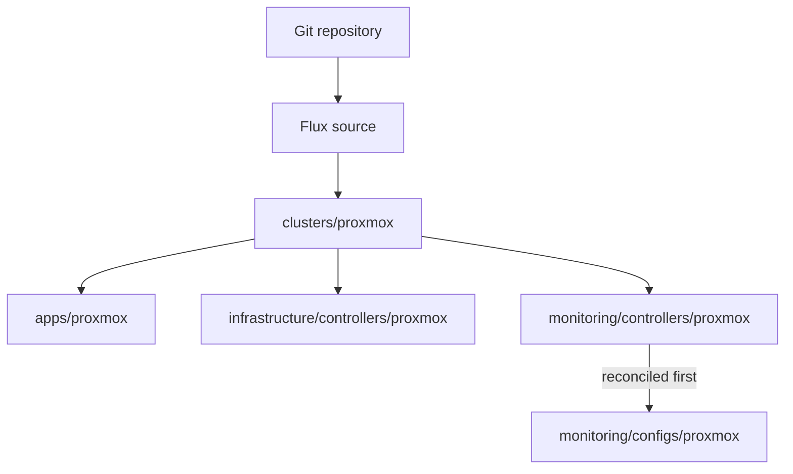
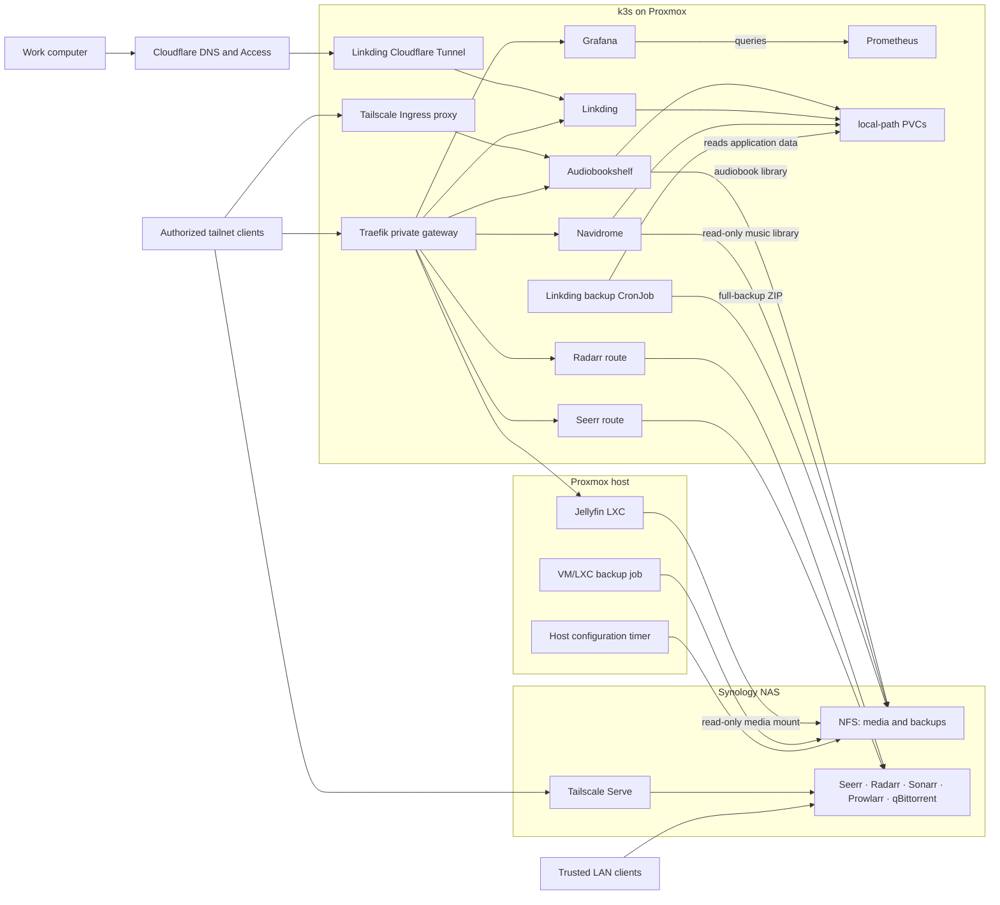

# Proxmox Kubernetes Cluster

GitOps configuration for a self-hosted Kubernetes cluster running on Proxmox.
Flux continuously reconciles the desired state from the `main` branch.

This repository is environment-specific rather than a reusable public template:
the Proxmox overlays contain hostnames, storage paths, and private LAN addresses
that are required at runtime. These values are infrastructure metadata, not
authentication credentials. See [Security and address disclosure](SECURITY.md)
before publishing or copying the configuration.

## Stack

- Kubernetes (k3s) and Flux CD
- Kustomize and Helm
- SOPS with Age for encrypted Kubernetes secrets
- Tailscale Kubernetes Operator and Tailscale Serve for private access
- Traefik with Let's Encrypt DNS-01 certificates for private custom domains
- Cloudflare Tunnel and Access for the protected Linkding work route
- Prometheus and Grafana for monitoring
- Renovate for dependency updates
- Synology NAS for NFS storage, backups, and media automation

## Workloads and access paths

| Workload | Runs on | Access path |
| --- | --- | --- |
| Audiobookshelf | k3s | Direct Tailscale Ingress and the private Traefik gateway |
| Linkding | k3s | Private Traefik gateway at `linkding.vitalyguzun.com` and a Cloudflare Access-protected work route at `linkding-work.vitalyguzun-homelab.com` |
| Navidrome | k3s | Private Traefik gateway over Tailscale |
| Grafana | k3s | Private Traefik gateway over Tailscale |
| Jellyfin | Dedicated Proxmox LXC | Private Traefik gateway forwarding to a fixed LAN endpoint |
| Seerr | Synology Container Manager | Trusted LAN, Tailscale Serve on port `8443`, and the private Traefik gateway at `seerr.vitalyguzun.com` |
| Radarr | Synology Container Manager | Trusted LAN and the private Traefik gateway at `radarr.vitalyguzun.com` |
| Sonarr, Prowlarr, qBittorrent | Synology Container Manager | Trusted LAN only |

The private custom-domain routes resolve to the Tailscale address of the shared
`homelab-gateway` service. A public DNS record does not make these routes public:
clients still need tailnet access, and Tailscale Funnel is not enabled.

Linkding is the only workload that retains a Cloudflare Tunnel. The work route
exists for a managed computer that cannot join the tailnet; it does not replace
the private route used by tailnet clients. See the
[Linkding access runbook](apps/proxmox/linkding/ACCESS.md) for the DNS, Access,
and Tunnel sources of truth.

## Repository structure

```text
.
├── apps/
│   ├── base/                       # Reusable Kubernetes application manifests
│   └── proxmox/                    # Environment overlays and ingress routes
├── clusters/
│   └── proxmox/                    # Flux entry point and reconciliation objects
├── infrastructure/
│   ├── controllers/
│   │   ├── base/                   # Reusable controller definitions
│   │   └── proxmox/                # Tailscale, Traefik, and Renovate overlays
│   └── proxmox-backup/             # Host-configuration backup script and units
├── monitoring/
│   ├── controllers/                # kube-prometheus-stack installation
│   └── configs/                    # Post-install monitoring resources
├── synology/
│   └── media-automation/           # Compose workload and private-access guide
└── renovate.json
```

## GitOps reconciliation



The root Flux Kustomization is defined in
`clusters/proxmox/flux-system/gotk-sync.yaml`. The Synology Compose workload and
the Proxmox host backup units are intentionally outside Flux and are installed
through their respective runbooks.

## Runtime architecture



Direct Tailscale Ingress and the private custom-domain routes served by the
shared Traefik gateway are independent access paths. Removing one does not
remove the other. Linkding additionally has a work-computer route through
Cloudflare Tunnel; Cloudflare Access must protect that hostname before its DNS
route is published. No inbound router port or Tailscale Funnel is required.

## Storage and backups

- Audiobookshelf configuration and metadata use local-path PVCs; its audiobook
  library is a static `Retain` NFS volume on Synology.
- Navidrome keeps its database and cache on a local-path PVC and mounts the
  Synology music library read-only.
- Linkding stores application data on a local-path `ReadWriteOnce` PVC. Its
  backup Pod is scheduled next to the application and writes a validated ZIP to
  Synology every day at 03:15 (`Europe/Amsterdam`). See the
  [Linkding backup runbook](apps/proxmox/linkding/BACKUP.md). Access paths are
  documented separately in the
  [Linkding access runbook](apps/proxmox/linkding/ACCESS.md).
- Proxmox creates VM/LXC backups at 04:00 and host-configuration archives at
  04:30. Both use 7 daily, 4 weekly, and 3 monthly restore points. See the
  [Proxmox backup runbook](infrastructure/proxmox-backup/README.md).
- Synology media automation is a separate Compose workload. Seerr is the
  end-user request UI; the remaining interfaces are administrative. See the
  [private Seerr access guide](synology/media-automation/TAILSCALE.md).

NFS exports must be restricted by the Synology firewall and NFS permissions to
the exact clients that use them. They must never be exposed through router port
forwarding or Tailscale Funnel.

## Address configuration

Documentation uses role names instead of repeating the current LAN topology:

| Role | Source of truth |
| --- | --- |
| Synology NFS server | Audiobookshelf and Navidrome PVs, plus the Linkding backup CronJob |
| Jellyfin LXC endpoint | Selector-less Service and EndpointSlice in `apps/proxmox/jellyfin/service.yaml` |
| Kubernetes NFS clients | Synology NFS permissions; use the addresses of nodes that may mount each export |
| Shared tailnet gateway | `infrastructure/controllers/proxmox/traefik/tailscale-service.yaml` |
| Private application hostnames | Vercel DNS records pointing to the shared tailnet gateway, plus Ingress manifests next to each workload (the Seerr route proxies to the Synology LAN endpoint) |
| Linkding work hostname | Cloudflare DNS and Access, with the origin route in `apps/proxmox/linkding/cloudflared-config.yaml` |

Private RFC 1918 addresses do not allow an Internet user to route into the LAN
and should not be treated as passwords. They can still reveal useful topology
to an attacker, so they are not duplicated in diagrams or runbooks. The
environment-specific manifests retain the values needed by Kubernetes. Moving
those overlays to a private repository or resolving internal DNS names is
required if the topology itself must remain confidential.

## Secrets

Kubernetes secrets committed to the repository are encrypted with SOPS. Flux
decrypts them in the cluster using the `sops-age` Secret in the `flux-system`
namespace.

Do not commit unencrypted credentials, private keys, local `.env` files,
generated TLS files, decrypted manifests, or backup archives. Public DNS names,
SOPS Age recipients, loopback addresses, wildcard bind addresses, and public
DNS resolvers are not credentials. See [SECURITY.md](SECURITY.md) for the full
handling policy and incident guidance.

## Bootstrap

Bootstrap Flux against the Proxmox cluster and this repository:

```shell
flux bootstrap github \
  --owner=vitaly-guzun \
  --repository=raspberry-pi-cluster \
  --branch=main \
  --path=clusters/proxmox \
  --personal
```

Before bootstrapping, select the target Kubernetes context and create the
`flux-system/sops-age` Secret from the private Age identity. The private
identity must not be stored in this repository.

## Validation

Render every reconciled Kustomization before merging:

```shell
kubectl kustomize clusters/proxmox
kubectl kustomize apps/proxmox
kubectl kustomize infrastructure/controllers/proxmox
kubectl kustomize monitoring/controllers/proxmox
kubectl kustomize monitoring/configs/proxmox
```

For the Synology workload, copy `.env.example` to an ignored `.env`, fill in
the environment-specific values, and validate it on the target host with
`docker compose config`.
